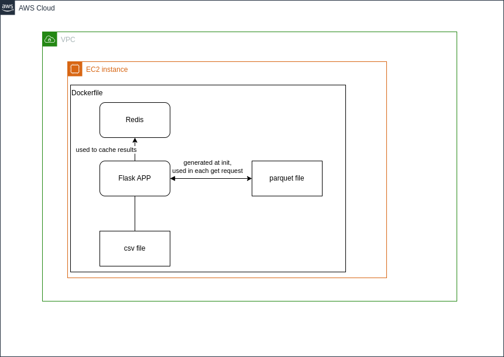
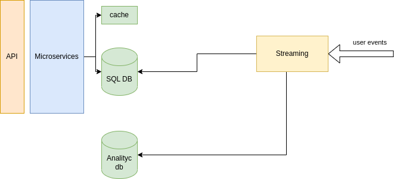

## Elaborado por Jorge Velandia

### Arquitectura de referencia


### Arquitectura implementada


# Nivel 1

- Ingresar a ./nivel1
- Ejecutar ```pip install requirements -r requirements.txt(se puede ejecutar creando un virtual environment)```
- Cambiar el java_home en el libro notebook.ipynb
- Ejecutar notebook.ipynb con el mismo kernel de spark donde se encuentra instaldo pyspark


# Nivel 2

- Ingresar a ./nivel1
- Ejecutar ```docker build -t service . ``` para construir la imagen
- Ejecutar ```docker run -p 7080:7080 service``` para subir el servicio
- - Esperar que el servicio suba, iniciando, el servicio va a convertir el archivo por lo cual tomara unos segundos
- Ejecutar ```http://localhost:7080/experiment/<<:id>>/result?day=YYYY-MM-DD+HH"```
- - por ejemplo ```http://localhost:7080/experiment/mclics/show-pads-search-list/result?day=2021-08-02+06"```

# Nivel 3
- Ingresar a ./nivel3
- hacer set de la variable de entorno 
- ejecutar terraform plan / apply
- probar en ```http://<<ec2-url>>/experiment/<<:id>/result/day=YYYY-MM-DD+HH```
